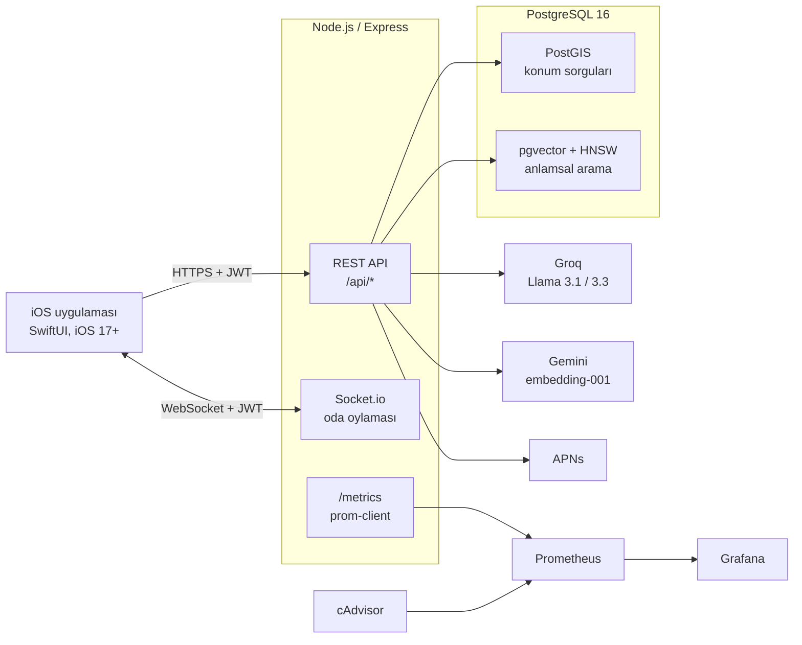
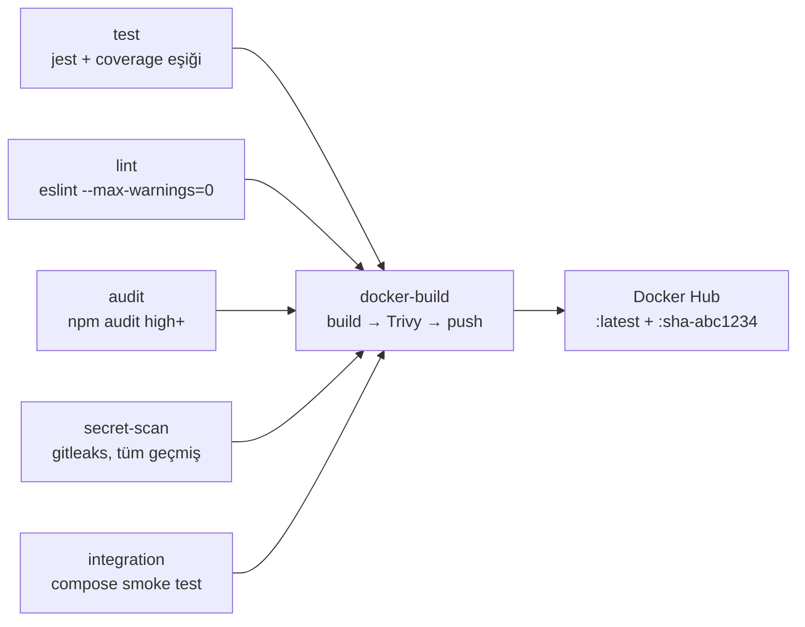

# MenuLo

Restoran keşif ve menü uygulaması: iOS istemci (SwiftUI) + Node.js/Express API + PostgreSQL (PostGIS & pgvector).

Kullanıcı yakınındaki restoranları konuma göre bulur, menülere doğal dille soru sorar ("acılı ve 200 TL altı bir şey"), arkadaşlarıyla gerçek zamanlı bir odada kaydırarak ortak karar verir. İşletme sahibi ise kendi menüsünü yönetir, son kullanma tarihi yaklaşan ürünleri indirimli "yeşil menü"ye düşürür ve yorumlara yanıt verir.

> Bu bir okul/portföy projesidir; production'da çalışmıyor. Aşağıdaki "Bilinçli sınırlar" bölümü nelerin kasıtlı olarak eksik bırakıldığını açıklar.

---

## İçindekiler

- [Özellikler](#özellikler)
- [Mimari](#mimari)
- [Hızlı başlangıç](#hızlı-başlangıç)
- [Teknoloji seçimleri ve nedenleri](#teknoloji-seçimleri-ve-nedenleri)
- [MenuBot: 3 aşamalı RAG hattı](#menubot-3-aşamalı-rag-hattı)
- [API özeti](#api-özeti)
- [Kalite kapıları ve CI/CD](#kalite-kapıları-ve-cicd)
- [İzleme](#izleme)
- [Proje yapısı](#proje-yapısı)
- [Bilinçli sınırlar ve yol haritası](#bilinçli-sınırlar-ve-yol-haritası)

---

## Özellikler

| Alan | Ne yapıyor |
| --- | --- |
| **Keşif** | PostGIS ile yarıçap içi restoran arama, mesafeye göre sıralama (`ST_DWithin` + `ST_Distance` üzerinde GiST index) |
| **MenuBot** | Menü öğeleri üzerinde doğal dilde soru-cevap; pgvector ile anlamsal arama + LLM ile gerekçelendirilmiş yanıt |
| **Oda (grup kararı)** | Socket.io ile gerçek zamanlı oylama: herkes onaylayınca `match_found`, deste tükenince yeni deste |
| **Yeşil menü** | Son kullanma tarihi yaklaşan ürünlerin indirimli listelenmesi (gıda israfını azaltma) |
| **İşletme paneli** | Menü CRUD, ürün fotoğrafı yükleme, restoran profili, yorumlara yanıt |
| **Hesap** | JWT ile kayıt/giriş, şifre sıfırlama (`menulo://` derin bağlantı), hesap silme |
| **Bildirim** | APNs push (oda eşleşmesi, yorum yanıtı) |

## Mimari



Tüm bileşenler tek bir `docker compose` dosyasıyla ayağa kalkar. Başlatma sırası `depends_on` koşullarıyla zorlanır:

```
db (healthy) → migrate (completed) → seed-embeddings (completed) → backend
```

Yani backend, şema hazır olmadan **hiç** başlamaz; sıralama umuda bırakılmamıştır.

## Hızlı başlangıç

Gereksinim: Docker Desktop (Compose v2.24+).

```bash
git clone <repo-url> && cd MenuLo

cp .env.example .env                     # DB kullanıcı/şifre (compose için)
cp backend/.env.example backend/.env     # JWT_SECRET zorunlu, AI anahtarları opsiyonel

docker compose up -d --build backend     # db → migrate → seed → backend

curl localhost:3000/health               # {"status":"ok"}
```

`JWT_SECRET` en az 32 karakter olmalı (`openssl rand -base64 48`), yoksa sunucu kasıtlı olarak başlamaz.

İzleme yığınını da isterseniz:

```bash
docker compose up -d          # + cAdvisor, Prometheus (:9091), Grafana (:3001, admin/admin)
```

**iOS tarafı** (XcodeGen ile proje üretilir, `.xcodeproj` repoda tutulmaz):

```bash
brew install xcodegen && xcodegen generate && open MenuLo.xcodeproj
```

**Smoke test** — tüm zincirin gerçekten ayağa kalktığını doğrular (CI'ın çalıştırdığının aynısı, kendi geliştirme verinize dokunmaz):

```bash
./scripts/smoke_test.sh
```

## Teknoloji seçimleri ve nedenleri

**PostgreSQL + PostGIS + pgvector — tek veritabanı.**
"Yakındaki restoranlar" için coğrafi sorgu, MenuBot için vektör araması gerekiyordu. İkisini ayrı sistemlere (ör. Elasticsearch + bir vektör DB'si) dağıtmak yerine tek Postgres'te tutmak, birleşik sorguya (`restaurant JOIN menu_item` + hem mesafe hem benzerlik filtresi) izin veriyor ve işletilecek servis sayısını üçe değil bire indiriyor. Bedeli: `db/Dockerfile` içinde uzantıların elle kurulması ve major sürüm yükseltmelerinin koordineli yapılması (bkz. [`.github/dependabot.yml`](.github/dependabot.yml)).

**pgvector'da HNSW index.** ~450 menü öğesi için brute-force de yeterdi; HNSW büyüme payı bırakıyor. `m=16, ef_construction=128` bu boyut için hız/doğruluk dengesinde makul bir orta nokta.

**İki farklı LLM sağlayıcısı.** Embedding Gemini'den (`gemini-embedding-001`, 768 boyut), üretim Groq'tan (Llama 3.1 8B sınıflandırma için, Llama 3.3 70B yanıt için) alınıyor. Sebep gecikme: Groq'un çıkarım hızı sohbet deneyimini taşıyabiliyor, sınıflandırma gibi ucuz işi küçük modele vermek de hem hızlı hem ucuz. Her dış çağrıda 8 saniyelik sabit timeout var — yavaş sağlayıcı isteği süresiz asmasın diye.

**Socket.io, ham WebSocket değil.** iOS istemcisi polling ile başlayıp WebSocket'e yükseliyor; kurumsal ağlarda ve zayıf bağlantıda yeniden bağlanma mantığını elle yazmak istemedik. Her soket bağlantısı REST ile aynı JWT ile doğrulanıyor, ayrıca odaya katılırken üyelik DB'den teyit ediliyor (token sahibi olmak o odanın üyesi olmak demek değil).

**Oda durumu bellekte.** Oy sayaçları ve deste bilgisi süreç belleğinde tutuluyor; oda boşalınca 5 dakikalık TTL ile siliniyor, bağlantı kopan kullanıcının "hayalet" oyları temizleniyor. Tek örnek (single instance) varsayımına dayanır — birden fazla backend örneğine çıkıldığında Redis'e taşınması gerekir. Bu bilinçli bir basitleştirme, gözden kaçmış bir eksik değil.

**Çok aşamalı Docker build.** Bağımlılıklar ayrı bir aşamada `npm ci --omit=dev` ile kuruluyor; build araçları ve npm cache'i çalışacak image'a hiç girmiyor. Container root değil `node` kullanıcısıyla çalışıyor, `init: true` ile SIGTERM düzgün iletilip graceful shutdown çalışıyor.

**`npm ci`, `npm install` değil.** Lock dosyası bağlayıcı: üretim image'ı CI'da test edilenin birebir aynı sürümlerini kurar, uyuşmazlıkta sessizce farklı sürüm çekmek yerine build kırılır.

## MenuBot: 3 aşamalı RAG hattı

`POST /api/menubot/ask` üç aşamadan geçer:

1. **Niyet sınıflandırma** (Llama 3.1 8B) — soru menüyle mi ilgili, hangi restoran kapsamında, fiyat/diyet filtresi var mı?
2. **Anlamsal arama** — soru Gemini ile 768 boyutlu vektöre çevrilir, `ORDER BY embedding <=> $1` ile en yakın öğeler çekilir. `FETCH_K = 3 × TOP_K` geniş çekilip her restorandan en fazla 2 öğe alınır; tek restoran sonuçların tamamını dolduramaz.
3. **Gerekçelendirilmiş yanıt** (Llama 3.3 70B) — model yalnızca 2. aşamada bulunan öğelerle cevap verir, menüde olmayan ürün uyduramaz.

Embedding'ler `backend/scripts/seed_embeddings.js` ile doldurulur; script idempotenttir — yalnızca `embedding IS NULL` olan satırları işler, dolayısıyla her `docker compose up`'ta güvenle yeniden çalışır ve gereksiz API çağrısı yapmaz.

## API özeti

| Yöntem | Yol | Not |
| --- | --- | --- |
| `POST` | `/api/auth/register`, `/api/auth/login` | rate-limit'li |
| `POST` | `/api/auth/forgot-password`, `/api/auth/reset-password` | `menulo://` derin bağlantı |
| `GET` | `/api/restaurants` | `?lat&lng&radius` ile PostGIS yarıçap araması |
| `GET` | `/api/restaurants/:id/menu`, `/:id/reviews`, `/:id/stats` | |
| `GET/POST/PUT/DELETE` | `/api/restaurants/:rid/menu/items`, `/api/menu/items/:itemId` | sahiplik doğrulamalı |
| `GET` | `/api/green-menu` | indirimli/son kullanma yaklaşan ürünler |
| `POST` | `/api/menubot/ask` | dakikada 30 istek sınırı |
| `POST/GET` | `/api/rooms/create`, `/join`, `/:roomId/restaurants` | REST ile oda kurulur, oylama Socket.io ile |
| `GET/PUT/DELETE` | `/api/users/me`, `/api/auth/me/stats`, `/api/auth/me/reviews` | |
| `POST` | `/api/notifications/register` | APNs cihaz token'ı |
| `GET` | `/health`, `/metrics` | kimlik doğrulaması yok |

Socket.io olayları: `join_room`, `submit_categories`, `start_voting`, `submit_vote` → `vote_update`, `match_found`, `deck_exhausted`, `member_joined/left`, `sync_room_state` (yeniden bağlanma senkronizasyonu).

## Kalite kapıları ve CI/CD

[`.github/workflows/backend-ci.yml`](.github/workflows/backend-ci.yml):



Kapıların her biri farklı bir soruya cevap veriyor:

- **test** — Jest, `collectCoverageFrom` ile tüm controller/middleware dosyalarını ölçüme zorlar (yoksa test edilmemiş dosyalar yüzdeye hiç girmez ve kapsam olduğundan yüksek görünür). Eşik cırcır dişlisi gibi çalışır: mevcut seviyenin hemen altındadır, testsiz kod eklenince CI kırılır.
- **audit** — yalnızca üretim bağımlılıkları (`--omit=dev`) ve yalnızca high/critical bloklar; geliştirme araçlarının zafiyetleri üretim image'ına girmediği için PR'ı durdurmaz.
- **secret-scan** — `fetch-depth: 0` ile tüm git geçmişi taranır; sırrın sonradan silinmiş olması sızmadığı anlamına gelmez.
- **integration** — [`scripts/smoke_test.sh`](scripts/smoke_test.sh) zinciri gerçekten ayağa kaldırır ve doğrular: backend healthy oluyor mu, `/health` ve `/metrics` cevap veriyor mu, `postgis` + `vector` uzantıları DB'de kurulu mu, migration'ların tamamı uygulanmış mı. **Neden gerekli:** `docker build` image'ı yalnızca kurar, çalıştırmaz — postgres 16→18 denemesi tam olarak bu yüzden tüm kontrollerden geçip yine de çalışmayacak durumdaydı.
- **docker-build** — image bir kez build edilir, Trivy ile taranır ve **aynı image** push edilir (`docker tag` katmanları değiştirmez, digest korunur). Taranan ile yayınlananın farklı build'ler olması riski böylece ortadan kalkar. `:latest` yanında `:sha-<commit>` etiketi yayınlanır; geri dönüş için sabit bir hedef gerekir.

Trivy raporlayıcı modda (`--exit-code 0`) çalışır: bulguların çoğu base image'dan gelir ve bu repodan düzeltilemez. Kalıcı kırmızı bir CI, taramanın görmezden gelinmesiyle sonuçlanır — uygulamanın kendi bağımlılıklarını zaten `audit` job'ı bloklayarak koruyor.

Bağımlılıklar Dependabot ile haftalık güncellenir; **major** Docker base image güncellemeleri kasıtlı olarak kapalıdır, gerekçesi [`dependabot.yml`](.github/dependabot.yml) içinde ayrıntılı yazılıdır.

## İzleme

`prom-client` ile toplanan metrikler `/metrics` üzerinden yayınlanır:

- `http_request_duration_seconds` / `http_requests_total` — route **pattern**'iyle etiketlenir (`/api/menu/:id`), gerçek ID ile değil; aksi halde her ID ayrı bir zaman serisi yaratıp Prometheus'u şişirirdi (cardinality patlaması)
- `db_pool_total_connections` / `idle` / `waiting` — bağlantı havuzu doluluk göstergeleri
- `socketio_connected_clients` — anlık aktif oda bağlantısı
- `menubot_intent_total` — MenuBot niyet dağılımı

Container tarafı metrikleri (CPU/RAM/ağ) cAdvisor'dan gelir. Grafana provisioning `monitoring/grafana/provisioning` altında.

## Proje yapısı

```
MenuLo/               iOS uygulaması (SwiftUI)
  App/ Views/ ViewModels/ Models/ Services/ Utilities/
backend/
  server.js           Express + Socket.io giriş noktası
  routes/ controllers/ middleware/ config/
  migrations/         sıralı .sql + run.js (uygulananlar _migrations tablosunda)
  scripts/            seed_embeddings.js
  tests/              Jest
db/Dockerfile         postgres:16.6 + PostGIS + pgvector
monitoring/           prometheus.yml, grafana provisioning
scripts/smoke_test.sh CI'ın da çalıştırdığı entegrasyon testi
docker-compose.yml    tüm yığın
docker-compose.ci.yml CI override'ı (smoke test için)
project.yml           XcodeGen proje tanımı
```

## Bilinçli sınırlar ve yol haritası

Bunlar gözden kaçmış değil, kapsam dışı bırakılmış maddeler:

- **CD yok.** Image Docker Hub'a çıkar ve orada durur; onu bir sunucuya indirip çalıştıran bir adım yok.
- **Alarm yok.** Prometheus kuralları tanımlı değil — şu an bir gösterge paneli, bir uyarı sistemi değil.
- **Oda durumu bellekte** — birden fazla backend örneği için Redis gerekir.
- **Yüklenen görseller yerel diskte** (`backend/uploads`) — üretimde S3/CDN gerekir.
- **İzleme image'ları `:latest`** ile sabitlenmemiş (uygulama ve DB image'ları sabitli).
- **iOS tarafı CI'da derlenmiyor** — pipeline yalnızca backend'i kapsıyor.
